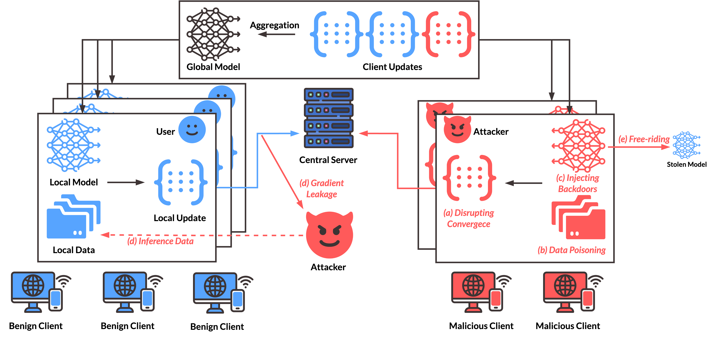

# Vulnerabilities and Defenses of Federated Learning
This is a list of papers reviewed in [A Survey on Vulnerability of Federated Learning: A Learning Algorithm Perspective](https://www.sciencedirect.com/science/article/pii/S0925231223013486).



## D2M
### Attacks
Poisoning Attacks against Support Vector Machines. [ACM](https://dl.acm.org/doi/10.5555/3042573.3042761)

Mitigating Sybils in Federated Learning Poisoning [arXiv](https://arxiv.org/abs/1808.04866)

Data Poisoning Attacks Against Federated Learning Systems [ACM](https://dl.acm.org/doi/10.1007/978-3-030-58951-6_24)

Semi-Targeted Model Poisoning Attack on Federated Learning via Backward Error Analysis [arXiv](https://arxiv.org/abs/2203.11633)

Attack of the Tails: Yes, You Really Can Backdoor Federated Learning [NIPS](https://proceedings.neurips.cc/paper/2020/hash/b8ffa41d4e492f0fad2f13e29e1762eb-Abstract.html)

PoisonGAN: Generative Poisoning Attacks Against Federated Learning in Edge Computing Systems [IEEE](https://ieeexplore.ieee.org/document/9194010)

Turning Federated Learning Systems Into Covert Channels [IEEE](https://ieeexplore.ieee.org/document/9984638)

Challenges and Approaches for Mitigating Byzantine Attacks in Federated Learning [arXiv](https://arxiv.org/abs/2112.14468)

Turning Privacy-preserving Mechanisms against Federated Learning [arXiv](https://arxiv.org/abs/2305.05355)

Local Environment Poisoning Attacks on Federated Reinforcement Learning [arXiv](https://arxiv.org/abs/2303.02725)

Data Poisoning Attacks on Federated Machine Learning [arXiv](https://arxiv.org/abs/2004.10020)

Understanding Distributed Poisoning Attack in Federated Learning [IEEE](https://ieeexplore.ieee.org/document/8975792)

### Defenses
Mitigating Sybils in Federated Learning Poisoning [arXiv](https://arxiv.org/abs/1808.04866)

Data Poisoning Attacks Against Federated Learning Systems [ACM](https://dl.acm.org/doi/10.1007/978-3-030-58951-6_24)

Understanding Distributed Poisoning Attack in Federated Learning [IEEE](https://ieeexplore.ieee.org/document/8975792)

Local Environment Poisoning Attacks on Federated Reinforcement Learning [arXiv](https://arxiv.org/abs/2303.02725)


## M2M
Machine Learning with Adversaries: Byzantine Tolerant Gradient Descent https://papers.nips.cc/paper_files/paper/2017/hash/f4b9ec30ad9f68f89b29639786cb62ef-Abstract.html

Generalized Byzantine-tolerant SGD https://arxiv.org/abs/1802.10116

A Little Is Enough: Circumventing Defenses For Distributed Learning https://proceedings.neurips.cc/paper/2019/hash/ec1c59141046cd1866bbbcdfb6ae31d4-Abstract.html

The Hidden Vulnerability of Distributed Learning in Byzantium http://proceedings.mlr.press/v80/mhamdi18a

Local model poisoning attacks to byzantine-robust federated learning https://dl.acm.org/doi/abs/10.5555/3489212.3489304

Free-rider Attacks on Model Aggregation in Federated Learning http://proceedings.mlr.press/v130/fraboni21a

Distributed Statistical Machine Learning in Adversarial Settings: Byzantine Gradient Descent https://dl.acm.org/doi/10.1145/3154503

Byzantine-Robust Distributed Learning: Towards Optimal Statistical Rates https://proceedings.mlr.press/v80/yin18a.html

## M2D
### Attacks
Hacking smart machines with smarter ones: How to extract meaningful data from machine learning classifiers [arXiv](https://arxiv.org/pdf/1306.4447.pdf)

Membership inference attacks against machine learning models [IEEE SP](https://ieeexplore.ieee.org/stamp/stamp.jsp?arnumber=7958568)

Defeating image obfuscation with deep learning [arXiv](https://arxiv.org/pdf/1609.00408.pdf)

The secret revealer: Generative model-inversion attacks against deep neural networks [IEEE CVPR](https://openaccess.thecvf.com/content_CVPR_2020/papers/Zhang_The_Secret_Revealer_Generative_Model-Inversion_Attacks_Against_Deep_Neural_Networks_CVPR_2020_paper.pdf)

Deep Models under the GAN: Information Leakage from Collaborative Deep Learning [ACM CCCS](https://dl.acm.org/doi/pdf/10.1145/3133956.3134012)

Exploiting Unintended Feature Leakage in Collaborative Learning [IEEE SP](https://ieeexplore.ieee.org/stamp/stamp.jsp?arnumber=8835269)

Auditing Privacy Defenses in Federated Learning via Generative Gradient Leakage [IEEE CVPR](https://openaccess.thecvf.com/content/CVPR2022/papers/Li_Auditing_Privacy_Defenses_in_Federated_Learning_via_Generative_Gradient_Leakage_CVPR_2022_paper.pdf)

Deep Leakage from Gradients [NeurIPS](https://proceedings.neurips.cc/paper/2019/file/60a6c4002cc7b29142def8871531281a-Paper.pdf)

Idlg: Improved Deep Leakage from Gradients [arXiv](https://arxiv.org/pdf/2001.02610.pdf)

Inverting Gradients-How Easy Is It to Break Privacy in Federated Learning? [NeurIPS](https://proceedings.neurips.cc/paper/2020/file/c4ede56bbd98819ae6112b20ac6bf145-Paper.pdf)

GRNN: Generative Regression Neural Network: A Data Leakage Attack for Federated Learning [ACM TIST](https://dl.acm.org/doi/abs/10.1145/3510032)

Gradient Inversion with Generative Image Prior [NeurIPS](https://proceedings.neurips.cc/paper/2021/file/fa84632d742f2729dc32ce8cb5d49733-Paper.pdf)

See through Gradients: {{Image}} Batch Recovery via Gradinversion [IEEE CVPR](https://openaccess.thecvf.com/content/CVPR2021/papers/Yin_See_Through_Gradients_Image_Batch_Recovery_via_GradInversion_CVPR_2021_paper.pdf)

Beyond Inferring Class Representatives: {{User-level}} Privacy Leakage from Federated Learning [IEEE ICCC](https://ieeexplore.ieee.org/stamp/stamp.jsp?arnumber=8737416)

### Defenses


# Citation

```
  @article{XIE2024127225,
  title = {A survey on vulnerability of federated learning: A learning algorithm perspective},
  author = {Xianghua Xie and Chen Hu and Hanchi Ren and Jingjing Deng},
  journal = {Neurocomputing},
  volume = {573},
  pages = {127225},
  year = {2024},
  issn = {0925-2312},
  doi = {https://doi.org/10.1016/j.neucom.2023.127225},
  url = {https://www.sciencedirect.com/science/article/pii/S0925231223013486},
  }
```
